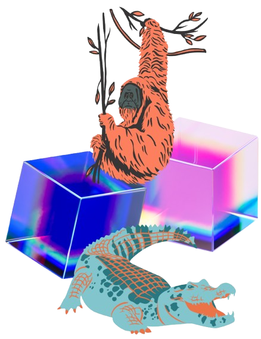

### Hi, I'm Wagner! 🧙‍♂️

##

A **B.S. in Software Engineering student** 🐦‍🔥 and a **Developer** ⚡ with professional experience since 2023.  
Currently, I focus on building efficient solutions 🚀 and constantly expanding my technical toolkit.

##

  &nbsp;&nbsp;
  &nbsp;&nbsp;
  &nbsp;&nbsp;
  &nbsp;&nbsp;
  &nbsp;&nbsp;
  &nbsp;&nbsp;
  &nbsp;&nbsp;
  &nbsp;&nbsp;
                

